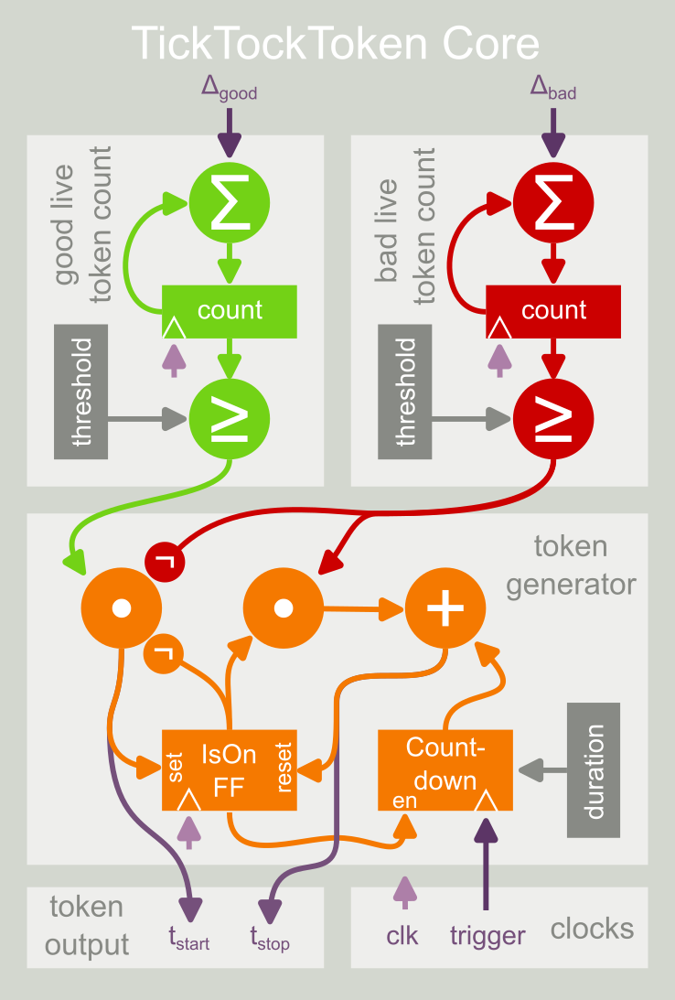
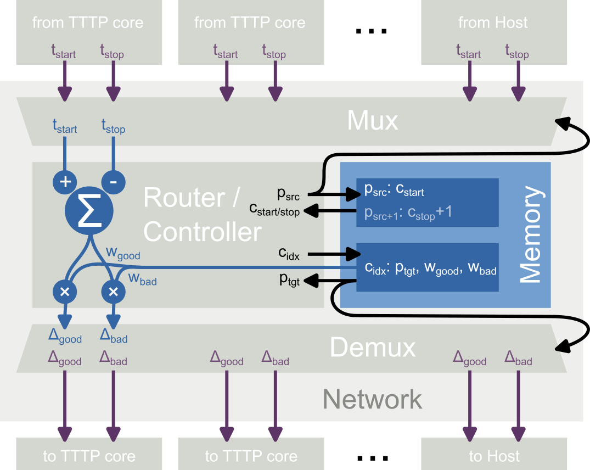
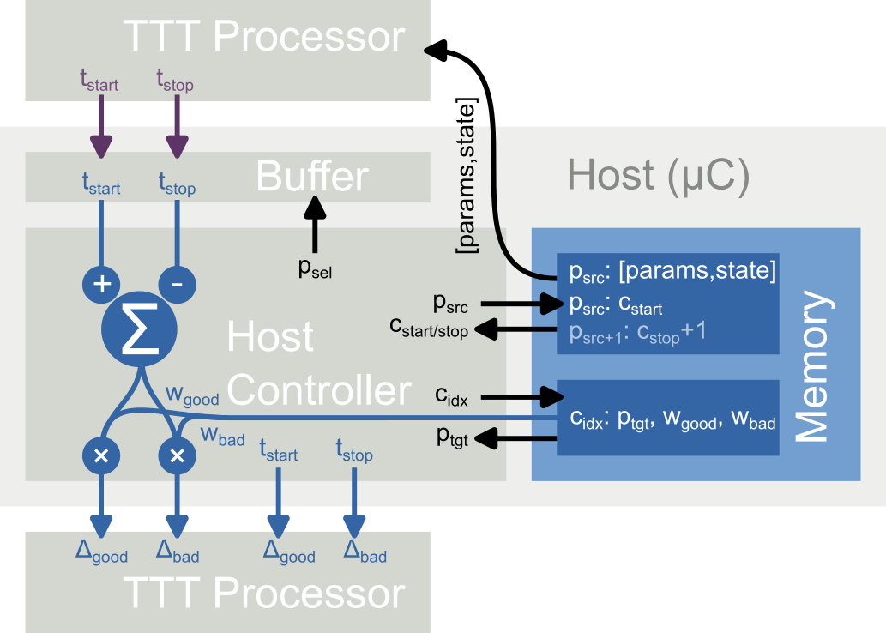

  

# ⏰ TickTockTokens
This project is an implementation of a *processor* that uses *Tick Tock Tokens* (TTT) for event-based computation.
TTTs have an expiry date and come in two flavors, *good* and *bad*, which can either trigger or interrupt/prevent a processor's generation of tokens.
If you put enough of these processors together, they can perform interesting computation.

The TickTockToken concept is a modification of Time-Petri-Nets that I came up with when trying to boil down event-based computing to its "atomic building blocks". I am using this concept in the context of simplified models of dendritic computation with spiking neurons, but it might be interesting for different applications, as well.
Your milage may vary.

## Uh ... wat?

Each TTT is an abstract "token", which is created by a processor when certain conditions are met, and then expires after a fixed amount of time. See the figure 1 below.

<table>
    <tr>
        <td>
            
        </td>
        <td>
            
        </td>
    </tr>
    <tr>
        <td>
            <em>Figure 1:</em> Logic implemented by a TickTockToken Processor.
        </td>
        <td>
            <em>Figure 2:</em> Possible routing arrangement between the processors.
        </td>
    </tr>
    <tr>
        <td colspan=2>
            
        </td>
    </tr>
    <tr>
        <td colspan=2>
           <em>Figure 3:</em> Actual time-multiplexed implementation of the TickTockToken concept for TinyTapeout. 
           A single processor is iteratively re-programmed and stimulated to emulate multiple parallel running processors.
        </td>
    </tr>
</table>

The lifetime of each token is tracked by a timer within the issuing processor, which begins counting down once a token is generated. When the timer runs out (or the token is otherwise terminated), I say that token has *expired*.

(Multiple) "entangled" copies of this token can be transmitted to (multiple) recipients, and each of these copies can be labeled as a *good* or a *bad* token. 
How many copies to send to from where to where, and whether to label each as *good* or *bad* is determined by the network *connectome*, which can be represented by a multi-directed-graph. 
Here, I'll treat the connectome as static for the entire simulation.

Each processor maintains counts of all good and all bad non-expired tokens it has received, which I'll call the *good* and the *bad live token count*, respectively.
The processor continuously monitors these two counts as new tokens come in or expire, and compares them against the respective *good* and *bad token threshold*.
While the bad token threshold is exceeded, the processor cannot generate any new tokens, and any already issued token(s) are *terminated*, i.e. they expire immediately.
If that is not the case and the good token threshold is exceeded, the processor will issue a new token (if it has capacity to do so; here, I'll assume a capacity of just one live token per processor, but this might change in future iterations).

When a new token is generated, this is communicated to all receiving processors by a *start* message; when the token ultimately expires (or is terminated), this is communicated by a second *stop* message. If a token would be started directly after it has been stopped (e.g. if the token expired while the conditions for generating a new token were met), the timer is just silently extneded, i.e. the timer is reset to full duration, and no message is sent instead (the start and stop message "cancel").
These messages could be either sent via hard-wired connections, or via a packet-switched network-on-chip.

## How to use it
For testing, run `test.py`.
For simulations, run the scripts in the /simulations folder (T.B.D).
For running the simulations on the actual hardware, run the scripts in the /experiments folder (T.B.D).

## Acknowledgements
The original idea for this concept emerged from joint work with [Pascal Nieters](https://scholar.google.com/citations?user=Bl2wxiQAAAAJ&hl=en) on a simple [event-based model of neural computation](https://www.frontiersin.org/articles/10.3389/fcogn.2023.1044216/full) that could be interesting for [a neuromorphic hardware implementation](https://dl.acm.org/doi/10.1145/3381755.3381763) and somewhat resembles an [extension of Time Petri Nets](https://dl.acm.org/doi/10.1145/3517343.3517362).

I decided to implement this in an ASIC as part of TinyNeuromorphicTapeout (TNT) project following the Telluride 2023 workshop area on [open source neuromorphic tools](https://sites.google.com/view/telluride-2023/topic-areas/osn23-open-source-neuromorphic-hardware-software-and-wetware).
Thanks to [Jason Eshraghian](https://www.jasoneshraghian.com/) and [Peng Zhou](https://pengzhou.sites.ucsc.edu/) for pushing and organizing the TNT project, and thanks to [ReJ](https://github.com/rejunity/) for helpful discussions!
The TNT project in turn is based on [TinyTapeout](https://tinytapeout.com), so I tip my hat to [Matt Venn](https://twitter.com/matthewvenn) and the TinyTapeout community for their efforts to democratize VLSI design!
